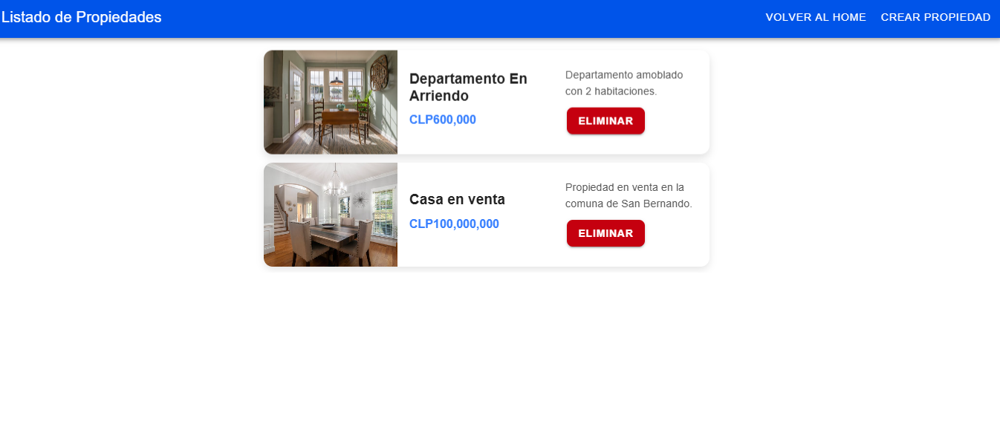
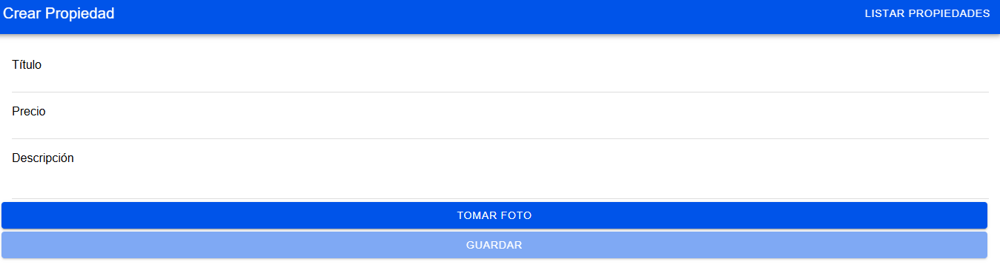

# App Propiedades - Corredores San Borja

## Descripción

Este proyecto fue desarrollado con **Ionic + Angular** como parte del examen de convalidación de la asignatura **Programación Híbrida**. La aplicación permite gestionar propiedades en arriendo y venta, ofreciendo una interfaz sencilla e intuitiva para crear, visualizar y eliminar publicaciones.

Incluye las siguientes funcionalidades:

- **Pantalla para listar propiedades** con su título, descripción, precio y foto.
- **Pantalla para crear propiedades** con validaciones de formulario y captura de imagen desde la cámara.
- **Persistencia de datos local** usando el plugin `@capacitor/preferences`.
- **Confirmación mediante modal** antes de eliminar una propiedad.
- **Formato de moneda aplicado al precio** usando `CurrencyPipe`.

---

## Tecnologías Usadas

- Ionic 7  
- Angular 17  
- Capacitor  
- HTML + SCSS  
- TypeScript  

---

## Instalación y Ejecución

1. Clona este repositorio:
```bash
git clone https://github.com/JAlexCastro/app-propiedades.git
cd app-propiedades
````

2. Instala las dependencias del proyecto:

```bash
npm install
```

3. Compila y sirve la app en tu navegador:

```bash
ionic serve
```

4. Para correr en un dispositivo o emulador, sincroniza Capacitor:

```bash
npx cap sync
```

---

## Capturas de pantalla

### 📋 Pantalla de home de propiedades


### 📋 Pantalla de listado de propiedades



### 🏠 Formulario de creación



---

## Uso

* Desde la **pantalla de inicio**, puedes acceder a:

  * Ver propiedades disponibles
  * Crear una nueva publicación

* En el formulario de creación:

  * Todos los campos son obligatorios.
  * El título requiere mínimo 5 caracteres.
  * La descripción requiere mínimo 20 caracteres.
  * Se puede capturar una fotografía desde la cámara.
---

## Autor

**Jose Alejandro Contreras**

[](https://www.linkedin.com/public-profile/settings?trk=d_flagship3_profile_self_view_public_profile)

